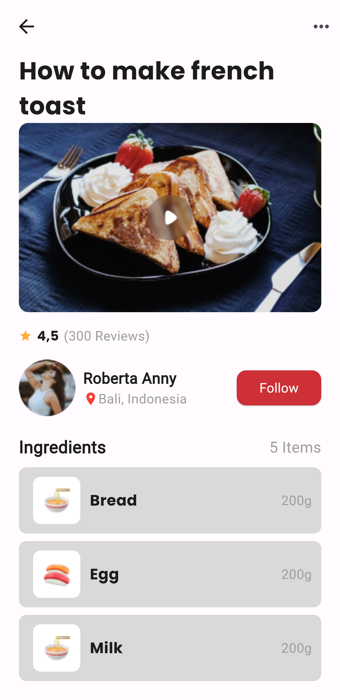

# Project Food Recipe

## Overview
This Flutter project provides a simple food recipe app showcasing various features. It includes UI components such as headers, images, star ratings, user profiles, ingredient sections, and item lists.

## Screenshots

## Features
TextHeader: Displays the title of the recipe in a specific font style.
ImageSection: Shows an image with a play button overlay.
StarRating: Displays star ratings and reviews.
ProfileFollow: Represents a user profile with follow functionality.
Ingredients: Displays the ingredients section with the number of items.
ItemSection: Shows a list of items with images, names, and weights.

# Usage
Modify the provided widgets or create new ones according to your app's requirements. Replace placeholder images and text with your own assets and data.

## Technologies Used
- Flutter
- Dart

